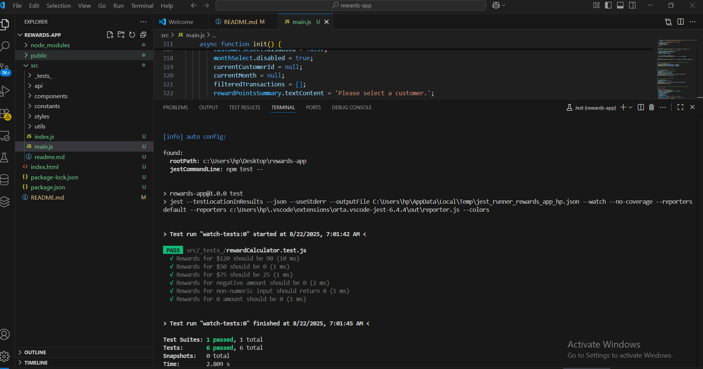

# Retailer Rewards Program
Overview
This project implements a rewards program for a retailer, where customers earn points based on their purchases. The points are calculated based on the amount spent in each transaction, with specific rules for different spending brackets. The application allows users to view their reward points per month and total points earned over a three-month period.

# App screens
 

# Features
Customers earn:
2 points for every dollar spent over $100.
1 point for every dollar spent between 
100.
Display of all customers with pagination.
Dynamic selection of customers to view their transaction details.
Month and year filters for transaction viewing.
Display of reward points earned per transaction.
Logging of transactions and calculations.
Unit tests to ensure the correctness of the reward calculation logic.

# Filters:
Default to the last 3 months.
Allow selection of months from January to December.
Include a year filter with values from 2021 to 2025.
Display "No transactions" if no data exists for the selected filter.

# Code Quality
Follow proper code splitting to avoid unnecessary re-renders.
Use ES6 modules with const and let (avoid var).
Adhere to file naming conventions and JavaScript folder structure.
Ensure all data passed to functions/modules/classes is dynamic; no hard-coded static data.
Move all static data to a constants file for reuse.

# CSS Stylings
 used tailwind js and css 
# Testing
Implement a minimum of 3 positive and 3 negative unit test cases, including tests for whole numbers and factorial values to verify the reward calculation logic. 
 # Project root folder // rewards-app/ run the below commands to test the app
 # npm install
 # npm test

Documentation
# Project Setup
Clone the repository.
Navigate to the project directory.
Open the index.html file in a web browser.
Running the Application
The application runs in the browser and fetches data from the local JSON file.
Use the dropdowns to filter transactions by month and year.

# Approach
The application fetches customer transaction data from a local JSON file.
Points are calculated based on the defined rules, and results are displayed dynamically.
Pagination and filtering enhance user experience and data management.
Screenshots
Include working screenshots of the application interface.
Include success screenshots of the test cases.

# Conclusion
This project provides a comprehensive rewards program for a retailer, allowing customers to track their points effectively. The implementation adheres to best practices in coding and design, ensuring a maintainable and user-friendly application.

